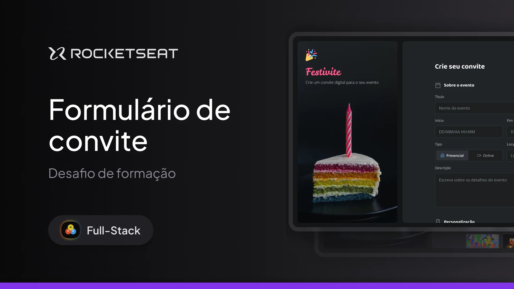

# Formulário de Convite - Rocketseat Full-Stack

Este projeto foi desenvolvido como parte dos meus estudos em **desenvolvimento web**. O objetivo é criar um **formulário interativo** para convites, aplicando conceitos de **HTML**, **CSS** e **JavaScript** para estruturar, estilizar e adicionar funcionalidades dinâmicas à página. O design foi planejado no **Figma**, visando uma interface intuitiva e moderna, seguindo boas práticas de desenvolvimento front-end.

---

## 🛠 **Tecnologias e Ferramentas**

Este projeto foi construído com as seguintes ferramentas:

- **HTML e CSS** – Estrutura e estilo da página
- **JavaScript** – Funcionalidade e interatividade
- **Figma** – Protótipo e planejamento visual
- **Git e GitHub** – Controle de versão e hospedagem do código

---

## 💻 **Projeto**

Confira abaixo uma prévia e acesse o projeto completo [aqui](https://festivite.netlify.app/):

---

## 📝 **Licença**

Este projeto está licenciado sob a **MIT License**. Consulte o arquivo [LICENSE](./LICENSE) para mais informações.

---

## 👨🏻‍💻 **Autor**

Feito por **Murillo Ressineti**, aluno da Rocketseat e desenvolvedor Full-Stack. Conecte-se comigo no LinkedIn para mais informações:

---

## 📬 **Contato**

Se você tiver dúvidas, sugestões ou gostaria de discutir sobre o projeto, sinta-se à vontade para entrar em contato!
