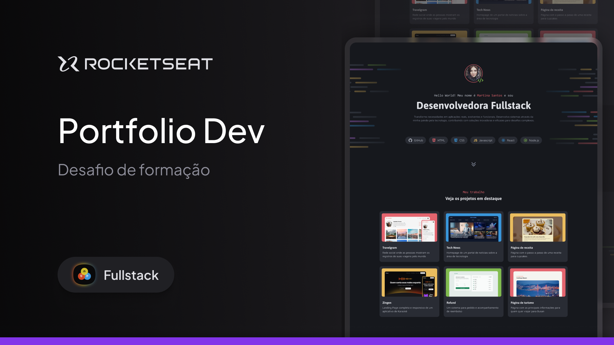

# Portfólio Dev - Rocketseat Full-Stack

Este repositório contém o projeto de um **portfólio** desenvolvido como parte dos meus estudos no bootcamp da **Rocketseat**. O objetivo do exercício foi criar uma página de portfólio para apresentar informações sobre uma desenvolvedora, utilizando **HTML** para a estrutura do projeto e **CSS** para a estilização. Além disso, o projeto explora conceitos de **responsividade** e **boas práticas de desenvolvimento web**.

---

## 🛠 **Tecnologias e Ferramentas**

As principais tecnologias utilizadas neste projeto foram:

- **Frontend**: HTML, CSS, JavaScript
- **Design**: Figma
- **Versionamento**: Git e GitHub

## 💻 **Visual do Projeto**

Confira abaixo uma prévia e acesse o projeto completo [aqui](https://martinadev.netlify.app/):

---

## 📝 **Licença**

Este projeto está licenciado sob a **MIT License**. Para mais detalhes, consulte o arquivo [LICENSE](./LICENSE).

---

## 👨🏻‍💻 **Autor**

Feito por **Murillo Ressineti**, aluno da Rocketseat e desenvolvedor front-end. Conecte-se comigo no LinkedIn para mais informações:

---

## 📬 **Contato**

Se você tiver dúvidas, sugestões ou gostaria de discutir sobre o projeto, sinta-se à vontade para entrar em contato!
