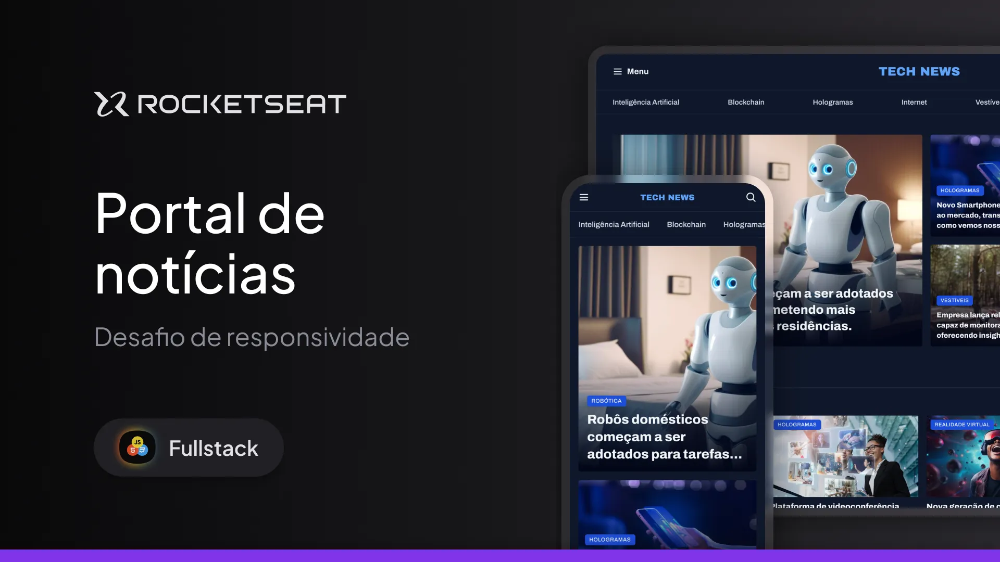

# Portal de Notícias - Rocketseat Full-Stack

Este repositório é dedicado a um dos projetos desenvolvidos durante o curso **Full-Stack** da **Rocketseat**. O foco desta atividade foi a criação de um **portal de notícias**, com organização e disposição dos elementos por meio de **`display: grid`**. 

A **responsividade** foi implementada para garantir que o portal se adapte corretamente a diferentes tamanhos de tela, proporcionando uma boa experiência tanto em dispositivos móveis e desktops.

A estrutura do projeto segue boas práticas de **HTML5 semântico**, com estilização feita em **CSS3**. O layout foi baseado em um protótipo no **Figma**, e o controle de versão foi feito utilizando **Git** e **GitHub**.

---

## 🛠 **Tecnologias e Ferramentas**

Aqui estão as tecnologias utilizadas no desenvolvimento deste projeto:

- **HTML e CSS**: Estruturação semântica e estilização da página
- **Figma**: Ferramenta de design para guiar o layout
- **Git e GitHub**: Controle de versão e hospedagem do código

---

## 💻 **Projeto**

Abaixo, uma prévia visual do projeto desenvolvido:

---

## 📝 **Licença**

Este projeto está sob a licença **MIT**. Para mais detalhes, consulte o arquivo [LICENSE](./LICENSE).

---

## 👨🏻‍💻 **Autor**

Feito por **Murillo Ressineti**, aluno da Rocketseat e desenvolvedor Full-Stack. Conecte-se comigo no LinkedIn para mais informações:

---

## 📬 **Contato**

Se você tiver dúvidas, sugestões ou gostaria de discutir sobre o projeto, sinta-se à vontade para entrar em contato!
