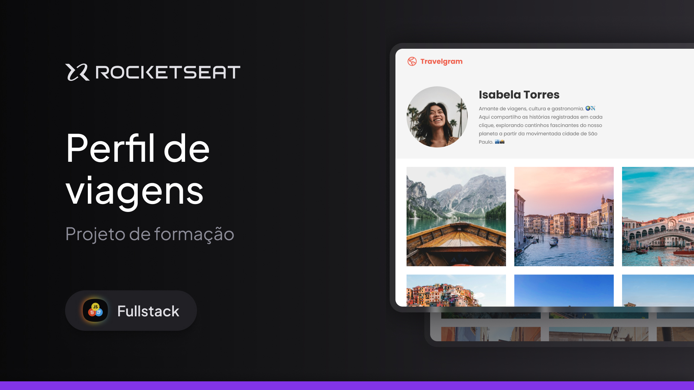

# Travelgram | Perfil de Viagens - Rocketseat Full-Stack

Este repositório faz parte dos projetos desenvolvidos no curso **Full-Stack** da **Rocketseat**. O objetivo deste projeto foi a criação de um perfil de viagens com foco na **organização do CSS**, utilizando importações e um arquivo `index.css` central para os estilos. Também foi aplicado o uso de **`display: flex`** para alinhar e distribuir os elementos. As tecnologias principais foram **HTML** e **CSS**, com o suporte do **Figma** para o design visual e **Git/GitHub** para o versionamento de código.

---

## 🛠 **Tecnologias e Ferramentas**

Aqui estão as tecnologias utilizadas no desenvolvimento deste projeto:

- **HTML e CSS**: Estrutura e estilização da página
- **Figma**: Protótipo e design visual
- **Git e GitHub**: Controle de versão e repositório de código

---

## 💻 **Projeto**

Confira abaixo uma prévia e acesse o projeto completo [aqui](https://triptravelgram.netlify.app/):

---

## 📝 **Licença**

Este projeto está sob a licença **MIT**. Para mais detalhes, consulte o arquivo [LICENSE](./LICENSE).

---

## 👨🏻‍💻 **Autor**

Feito por **Murillo Ressineti**, aluno da Rocketseat e desenvolvedor Full-Stack. Conecte-se comigo no LinkedIn para mais informações:

---

## 📬 **Contato**

Se você tiver dúvidas, sugestões ou gostaria de discutir sobre o projeto, sinta-se à vontade para entrar em contato!
