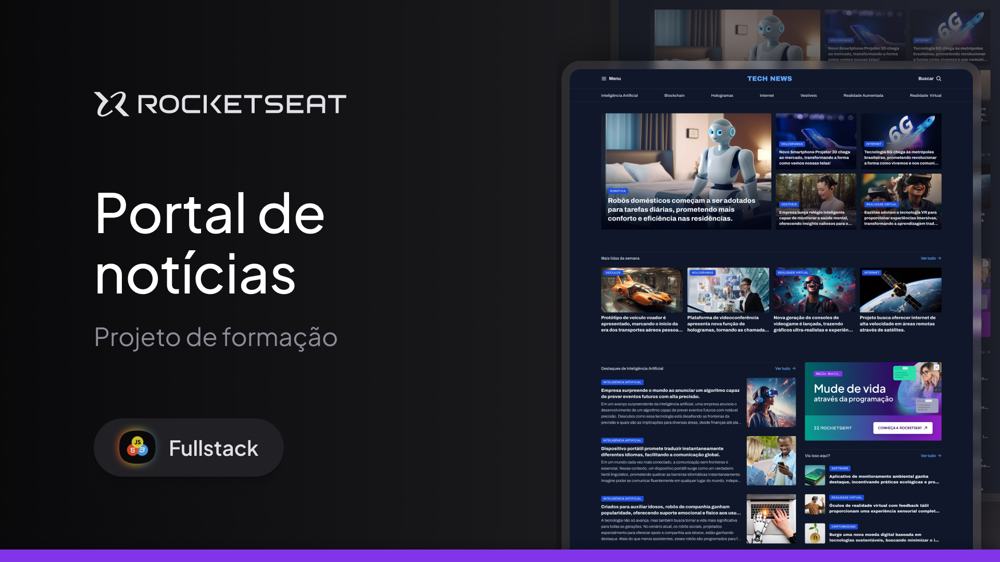

<h1 align="center">Portal de Notícias</h1>

  Este projeto faz parte do bootcamp do curso Full Stack da Rocketseat. O foco desta atividade foi a organização e disposição dos elementos utilizando <code>display: grid</code>. A estrutura do projeto também fez uso do HTML5 semântico, estilização com CSS3, e controle de versão com Git/GitHub.

 

## 🛠 Tecnologias

Esse projeto foi desenvolvido com as seguintes tecnologias:

- HTML, CSS
- Figma
- Git, GitHub

## 💻 Projeto

## 📝 Licença

Esse projeto está sob a licença MIT.

## 🙋🏻‍♂️ Autor

Feito com 💙 por Murillo Ressineti.

