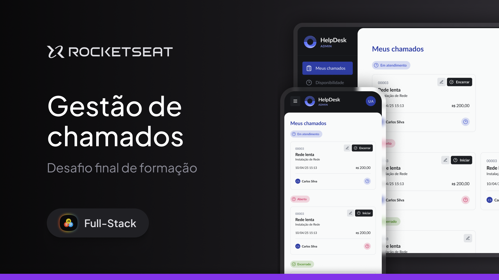

# Help Desk - Front-end

Sistema de gerenciamento de chamados desenvolvido como projeto de conclusão da formação **Full-Stack da Rocketseat**, simulando um ambiente real de suporte técnico com diferentes níveis de acesso (**Administrador, Técnico e Cliente**).

A aplicação foi construída utilizando **React**, **TypeScript** e **Vite**, seguindo uma arquitetura modular baseada em componentes reutilizáveis, formulários tipados, autenticação via JWT e integração completa com uma API REST desenvolvida em Node.js.

---

## 💻 Demonstração

A aplicação está disponível em:

**🔗 https://webhelpdesk.vercel.app/**



---

## 🚀 Funcionalidades

O sistema possui três perfis de acesso com permissões independentes:

### 👑 Administrador

- Gerenciamento completo de chamados.
- Cadastro, edição e exclusão de técnicos.
- Cadastro, edição e exclusão de clientes.
- Cadastro e gerenciamento de serviços.
- Alteração do status de qualquer chamado.
- Visualização completa dos detalhes de atendimento.

### 👨‍🔧 Técnico

- Visualização dos chamados atribuídos.
- Início e encerramento de atendimentos.
- Adição e remoção de serviços adicionais.
- Alteração obrigatória de senha no primeiro acesso.
- Atualização do próprio perfil.

### 👤 Cliente

- Cadastro e autenticação.
- Abertura de novos chamados.
- Acompanhamento do status em tempo real.
- Visualização completa do histórico de atendimentos.

---

## 🛠 Tecnologias e Ferramentas

Aqui estão as principais tecnologias utilizadas no desenvolvimento deste projeto:

* **Framework & Core:** React + Vite + TypeScript.
* **Tailwind CSS:** Construção de uma interface responsiva, consistente e baseada em Design System.
    * **CVA (Class Variance Authority):** Criação de componentes reutilizáveis com múltiplas variantes visuais.
    * **Clsx & Tailwind Merge:** Composição dinâmica de classes CSS sem conflitos.
* **Arquitetura da Aplicação:**
    * **React Router DOM:** Gerenciamento das rotas e controle de acesso entre Administrador, Técnico e Cliente.
    * **Context API:** Gerenciamento global da autenticação e sessão do usuário.
* **Formulários e Validação:**
    * **React Hook Form:** Gerenciamento performático dos formulários.
    * **Zod:** Validação tipada dos dados e integração com TypeScript.
* **Comunicação com a API:**
    * **Axios:** Consumo da API REST.
    * **JWT + Interceptors:** Autenticação automática e envio seguro do token em todas as requisições protegidas.
* **Experiência do Usuário (UX):**
    * **Sonner:** Sistema de notificações (Toasts).
    * **Skeleton Loading:** Feedback visual durante carregamentos.
    * **Modais reutilizáveis:** Confirmação de exclusão, descarte de alterações e gerenciamento de serviços.
    * **Interface totalmente responsiva:** Adaptada para desktop, tablet e dispositivos móveis.

---

## 🏗 Arquitetura

O projeto foi organizado utilizando uma arquitetura modular para facilitar manutenção e escalabilidade.

```
src
│
├── assets
├── components
│   ├── ui
│   ├── layout
│   └── features
├── contexts
├── lib
├── pages
├── routes
├── schemas
├── services
├── types
└── utils
```

Entre as principais boas práticas utilizadas estão:

- Componentização baseada em responsabilidade.
- Separação entre UI e regras de negócio.
- Tipagem completa com TypeScript.
- Validação centralizada utilizando Zod.
- Organização por features.
- Componentes reutilizáveis para formulários, badges, modais e tabelas.
- Tratamento consistente de erros da API.

---

## ⚙️ Executando localmente

### Clone o projeto

```bash
git clone https://github.com/murilloressineti/full-stack-rocketseat
```

### Instale as dependências

```bash
pnpm install
```

### Configure as variáveis de ambiente

Crie um arquivo `.env` na raiz do projeto.

```env
VITE_API_URL=http://localhost:3333
```

### Execute

```bash
pnpm dev
```

---

## 🌐 Deploy

- **Front-end:** Vercel
- **Back-end:** Render
- **Banco de dados:** Neon PostgreSQL

---

## 👨🏻‍💻 **Autor**

**Murillo Ressineti** — Desenvolvedor Front-end. Graduando em Análise e Desenvolvimento de Sistemas pela **Universidade Mackenzie** e imersão técnica pela **Rocketseat**.

• [LinkedIn](https://www.linkedin.com/in/murilloressineti/) • [E-mail](mailto:murillo@ressineti.com.br) • [Portfólio](https://murilloressineti.com.br/)

---

## 📝 **Licença**

Este projeto está sob a licença **MIT**. Para mais detalhes, consulte o arquivo [LICENSE](./LICENSE).