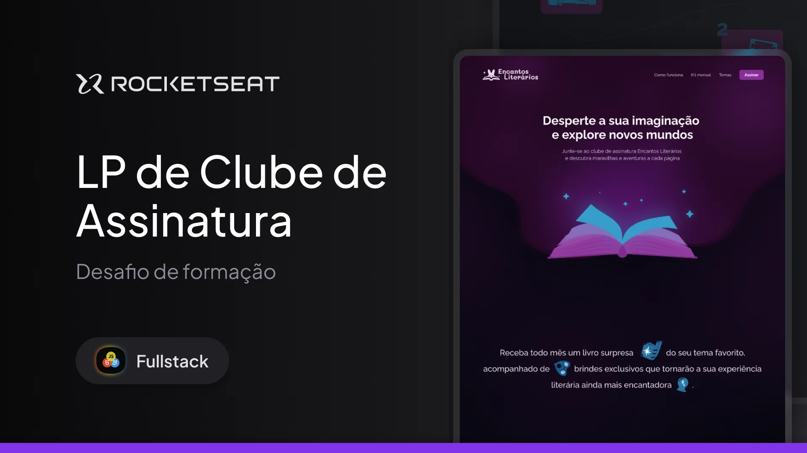

# Landing Page Clube de Assinatura de Livros - Rocketseat Full-Stack

Projeto desenvolvido com o objetivo de criar uma **landing page para um clube de assinatura de livros**, focando em proporcionar uma experiência visual atraente e informativa sobre o produto. Utiliza **CSS Animations** para interações dinâmicas, **responsividade** para adaptar-se a diferentes dispositivos, **CSS Transitions** para transições suaves e **CSS Functions** para estilização avançada.

---

## 🛠 **Tecnologias e Ferramentas**

Aqui estão as tecnologias utilizadas no desenvolvimento deste projeto:

- **HTML e CSS**: Estruturação semântica e estilização da página
- **Figma**: Ferramenta de design para guiar o layout
- **Git e GitHub**: Controle de versão e hospedagem do código

---

## 💻 **Projeto**

Confira abaixo uma prévia e acesse o projeto completo [aqui](https://encantosliterarios.netlify.app/):

---

## 📝 **Licença**

Este projeto está sob a licença **MIT**. Para mais detalhes, consulte o arquivo [LICENSE](./LICENSE).

---

## 👨🏻‍💻 **Autor**

Feito por **Murillo Ressineti**, aluno da Rocketseat e desenvolvedor Front-end. Conecte-se comigo no LinkedIn para mais informações:

---

## 📬 **Contato**

Se você tiver dúvidas, sugestões ou gostaria de discutir sobre o projeto, sinta-se à vontade para entrar em contato!
