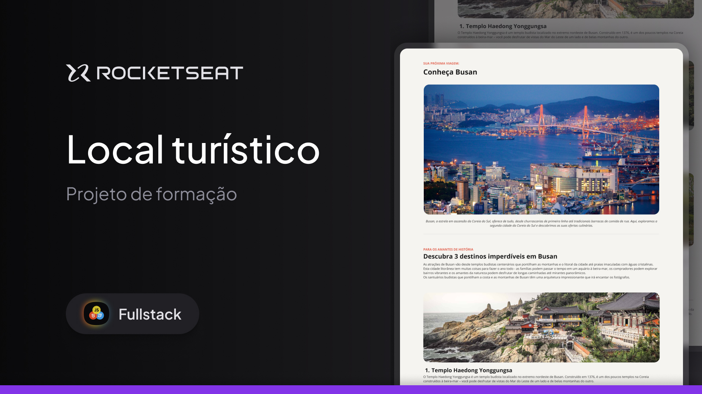

<h1 align="center">Local Turístico</h1>

  Este projeto é parte dos estudos realizados no bootcamp do curso Full Stack da Rocketseat. O objetivo do projeto é criar uma página web para apresentar um local turístico, utilizando as tecnologias HTML e CSS para o desenvolvimento front-end, além do uso do Figma para o design e Git/GitHub para controle de versão.

 

## 🛠 Tecnologias

Esse projeto foi desenvolvido com as seguintes tecnologias:

- HTML, CSS
- Figma
- Git, GitHub

## 💻 Projeto

## 📝 Licença

Esse projeto está sob a licença MIT.

## 🙋🏻‍♂️ Autor

Feito com 💙 por Murillo Ressineti.

