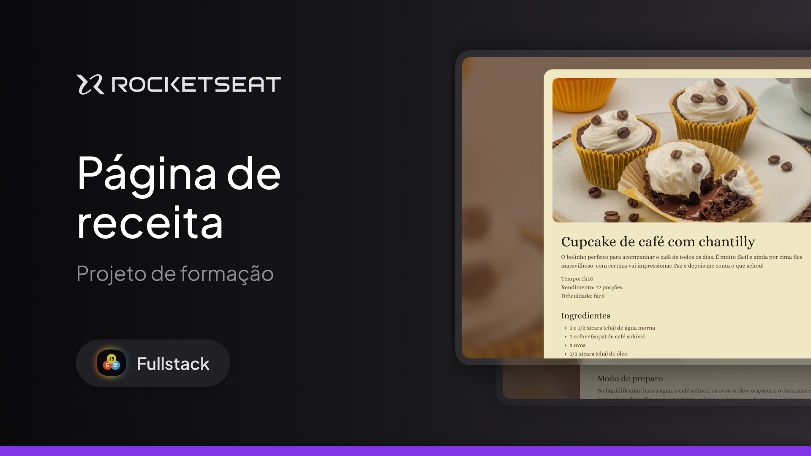

# Página de Receitas - Rocketseat Full-Stack

Este repositório é dedicado a um dos projetos desenvolvidos durante o curso **Full-Stack** da **Rocketseat**. A proposta deste projeto foi construir uma página de receitas utilizando **HTML** e **CSS**, com foco na prática de **listas ordenadas e não ordenadas**. A estrutura do conteúdo foi planejada de forma semântica e organizada, com base em um layout criado no **Figma**. O controle de versão foi realizado com **Git** e **GitHub**.

---

## 🛠 **Tecnologias e Ferramentas**

Aqui estão as tecnologias utilizadas no desenvolvimento deste projeto:

- **HTML e CSS**: Estruturação e estilização da página
- **Figma**: Ferramenta de design para guiar o layout
- **Git e GitHub**: Controle de versão e hospedagem do código

---

## 💻 **Projeto**

Confira abaixo uma prévia e acesse o projeto completo [aqui](https://receitacupcakecafe.netlify.app/):

---

## 📝 **Licença**

Este projeto está sob a licença **MIT**. Para mais detalhes, consulte o arquivo [LICENSE](./LICENSE).

---

## 👨🏻‍💻 **Autor**

Feito por **Murillo Ressineti**, aluno da Rocketseat e desenvolvedor Full-Stack. Conecte-se comigo no LinkedIn para mais informações:

---

## 📬 **Contato**

Se você tiver dúvidas, sugestões ou gostaria de discutir sobre o projeto, sinta-se à vontade para entrar em contato!
