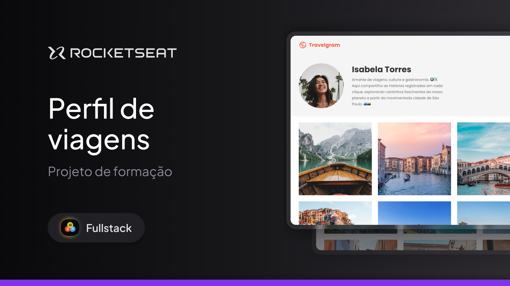

<h1 align="center">Travelgram | Perfil de Viagens</h1>

  Este projeto é parte dos estudos realizados no bootcamp do curso Full Stack da Rocketseat. O foco deste projeto foi a organização do CSS, utilizando a estruturação por meio de importações e o arquivo index para centralizar os estilos. Além disso, foi aplicado o uso do <code>display: flex</code>. As tecnologias HTML e CSS foram utilizadas para o desenvolvimento front-end, junto com o Figma para o design e Git/GitHub para controle de versão.

 

## 🛠 Tecnologias

Esse projeto foi desenvolvido com as seguintes tecnologias:

- HTML, CSS
- Figma
- Git, GitHub

## 💻 Projeto

## 📝 Licença

Esse projeto está sob a licença MIT.

## 🙋🏻‍♂️ Autor

Feito com 💙 por Murillo Ressineti.

