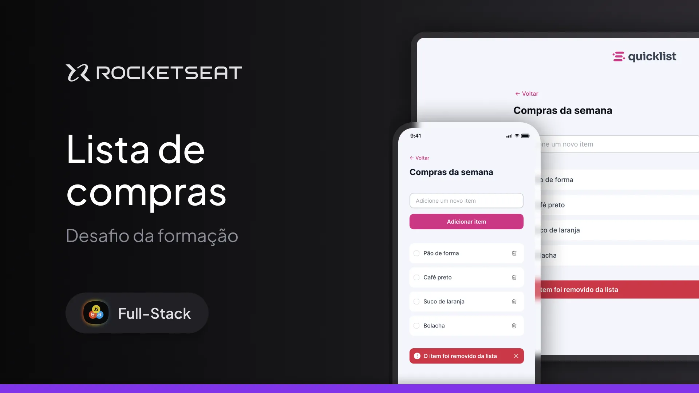

# Quicklist - Lista de Compras - Rocketseat Full-Stack

Projeto desenvolvido com o objetivo de criar uma **lista de compras interativa e responsiva**, onde o usuário pode **adicionar, riscar e remover itens**, com uma interface amigável e alertas visuais. A aplicação foi construída utilizando **HTML5 semântico**, **CSS3** e **JavaScript**, proporcionando uma experiência prática e moderna para organização das compras da semana.

---

## 🛠 **Tecnologias e Ferramentas**

Aqui estão as tecnologias utilizadas no desenvolvimento deste projeto:

- **HTML e CSS**: Estruturação semântica e estilização da página
- **JavaScript**: Manipulação de eventos, DOM e lógica de interação
- **Figma**: Ferramenta de design para guiar o layout
- **Git e GitHub**: Controle de versão e hospedagem do código

---

## 💻 **Projeto**

Confira abaixo uma prévia e acesse o projeto completo [aqui](https://quicklistapp.netlify.app/):

---

## 📝 **Licença**

Este projeto está sob a licença **MIT**. Para mais detalhes, consulte o arquivo [LICENSE](./LICENSE).

---

## 👨🏻‍💻 **Autor**

Feito por **Murillo Ressineti**, aluno da Rocketseat e desenvolvedor Front-end. Conecte-se comigo no LinkedIn para mais informações:

---

## 📬 **Contato**

Se você tiver dúvidas, sugestões ou gostaria de discutir sobre o projeto, sinta-se à vontade para entrar em contato!
