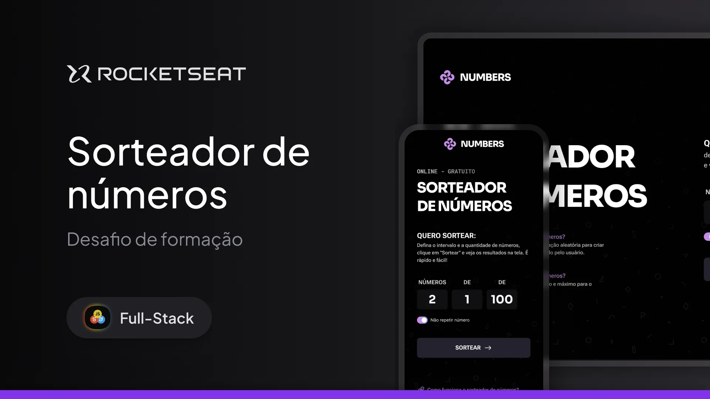

# Sorteador de Números - Rocketseat Full-Stack

Projeto desenvolvido com o objetivo de criar um **sorteador de números interativo**, onde o usuário pode **definir um intervalo numérico**, escolher a **quantidade de números a sortear**, e ainda optar por permitir ou não **números repetidos**. A aplicação foi construída utilizando **HTML5 semântico**, **CSS3** e **JavaScript moderno**, com foco em responsividade, validação de dados e uma interface animada e intuitiva.

---

## 🛠 **Tecnologias e Ferramentas**

Aqui estão as tecnologias utilizadas no desenvolvimento deste projeto:

- **HTML e CSS**: Estruturação semântica e design responsivo
- **JavaScript**: Manipulação de DOM, lógica do sorteio e animações
- **Figma**: Ferramenta de design para guiar o layout
- **Git e GitHub**: Controle de versão e hospedagem do código

---

## 💻 **Projeto**

Confira abaixo uma prévia e acesse o projeto completo [aqui](https://sorteanumeros.netlify.app/):

---

## 📝 **Licença**

Este projeto está sob a licença **MIT**. Para mais detalhes, consulte o arquivo [LICENSE](./LICENSE).

---

## 👨🏻‍💻 **Autor**

Feito por **Murillo Ressineti**, aluno da Rocketseat e desenvolvedor Front-end. Conecte-se comigo no LinkedIn para mais informações:

---

## 📬 **Contato**

Se você tiver dúvidas, sugestões ou gostaria de discutir sobre o projeto, sinta-se à vontade para entrar em contato!
