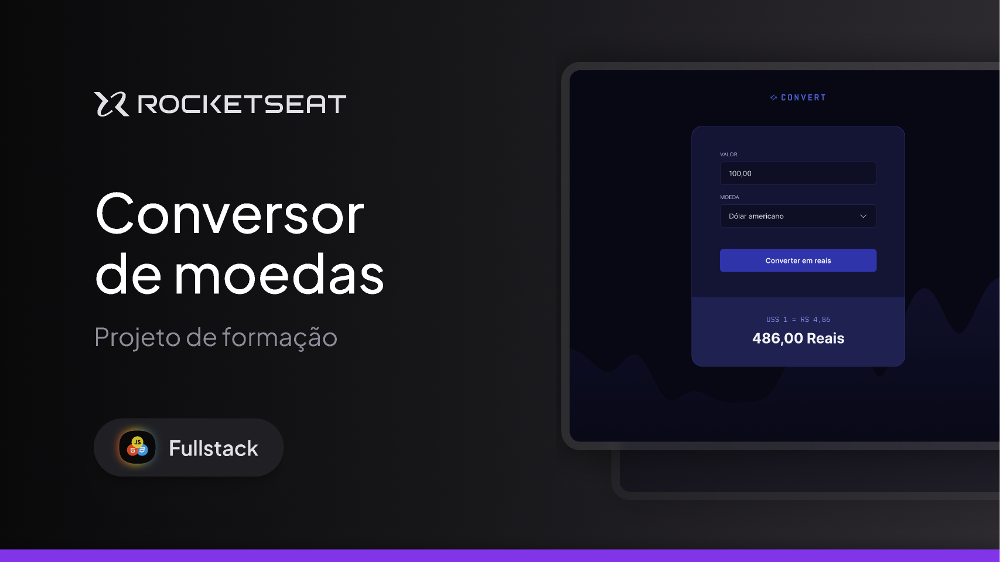

# Convert - Conversor de Moedas - Rocketseat Full-Stack

Projeto desenvolvido com foco na criação de um **conversor de moedas responsivo**, que permite ao usuário inserir um valor e convertê-lo para reais (BRL), com base em moedas estrangeiras como **Dólar Americano (USD)**, **Euro (EUR)** e **Libra Esterlina (GBP)**. A interface é simples, limpa e moderna, utilizando **HTML5 semântico**, **CSS3**, e **JavaScript** para manipulação dos dados e renderização dinâmica dos resultados.

---

## 🛠 **Tecnologias e Ferramentas**

Aqui estão as tecnologias utilizadas no desenvolvimento deste projeto:

- **HTML e CSS**: Estruturação semântica e estilização da página
- **JavaScript**: Lógica de conversão, validação e manipulação do DOM  
- **Figma**: Ferramenta de design para guiar o layout
- **Git e GitHub**: Controle de versão e hospedagem do código

---

## 💻 **Projeto**

Confira abaixo uma prévia e acesse o projeto completo [aqui](https://convertbr.netlify.app/):

---

## 📝 **Licença**

Este projeto está sob a licença **MIT**. Para mais detalhes, consulte o arquivo [LICENSE](./LICENSE).

---

## 👨🏻‍💻 **Autor**

Feito por **Murillo Ressineti**, aluno da Rocketseat e desenvolvedor Full-Stack. Conecte-se comigo no LinkedIn para mais informações:

---

## 📬 **Contato**

Se você tiver dúvidas, sugestões ou gostaria de discutir sobre o projeto, sinta-se à vontade para entrar em contato!
