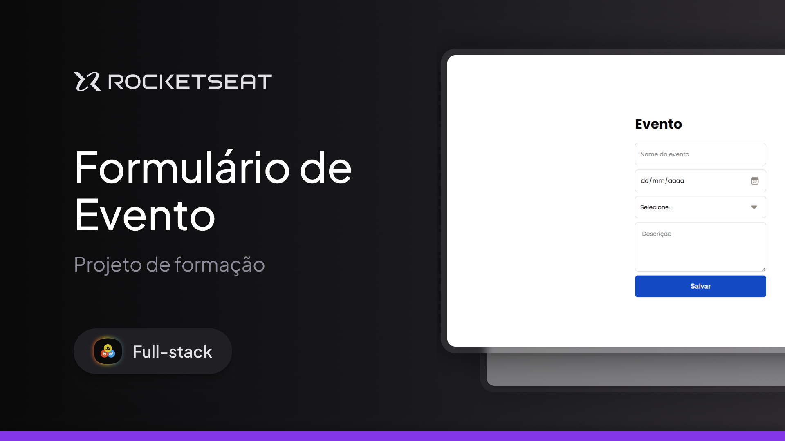

# Formulário de Evento - Rocketseat Full-Stack

Este projeto foi desenvolvido com o objetivo de **praticar a criação de formulários controlados em React** utilizando as bibliotecas **React Hook Form** e **Yup** para validação de dados de forma simples, escalável e elegante.

---

## 🛠 **Tecnologias e Ferramentas**

Aqui estão as tecnologias utilizadas no desenvolvimento deste projeto:

- **React**: Biblioteca JavaScript para construção de interfaces de usuário
- **TypeScript**: Tipagem estática para maior segurança e escalabilidade do código  
- **Vite**: Ferramenta de build e servidor de desenvolvimento rápido
- **React Hook Form**: Gerenciamento de formulários com foco em performance  
- **Yup**: Validação de dados com schemas declarativos  
- **CSS**: Estilização simples do formulário  
- **Git e GitHub**: Controle de versão e hospedagem do código  

---

## 💻 **Projeto**

Confira abaixo uma prévia e acesse o projeto completo [aqui](https://formulariodeevento.vercel.app/):



---

## 🎮 **Funcionalidades**

- Preencher formulário de evento com os seguintes campos:  
  - **Nome** (obrigatório)  
  - **Data** (obrigatória)  
  - **Assunto** (seleção obrigatória entre React, Node.js, JavaScript e TypeScript)  
  - **Descrição** (obrigatória, mínimo de 10 caracteres)  
- Exibir mensagens de erro personalizadas em tempo real  
- Submeter os dados válidos e exibi-los no **console**

---

## ⚙️ Instalação e Execução

Siga os passos abaixo para clonar o projeto e executá-lo localmente em sua máquina:

### ✅ Pré-requisitos

- [Node.js](https://nodejs.org/) instalado
- [Git](https://git-scm.com/) instalado

### 📥 1. Clone o repositório

```git clone https://github.com/murilloressineti/full-stack-rocketseat.git```

### 📂 2. Acesse a pasta do projeto
```cd full-stack-rocketseat/tree/main/react/avançando-no-react/react-forms```

### 📦 3. Instale as dependências
```npm install```

### 🚀 4. Execute o projeto
```npm run dev```

---

## 📝 **Licença**

Este projeto está sob a licença **MIT**. Para mais detalhes, consulte o arquivo [LICENSE](./LICENSE).

---

## 👨🏻‍💻 **Autor**

Feito por **Murillo Ressineti**, aluno da Rocketseat e desenvolvedor Front-end. Conecte-se comigo no LinkedIn para mais informações:

[](https://www.linkedin.com/in/murilloressineti/)

---

## 📬 **Contato**

Se você tiver dúvidas, sugestões ou gostaria de discutir sobre o projeto, sinta-se à vontade para entrar em contato!
