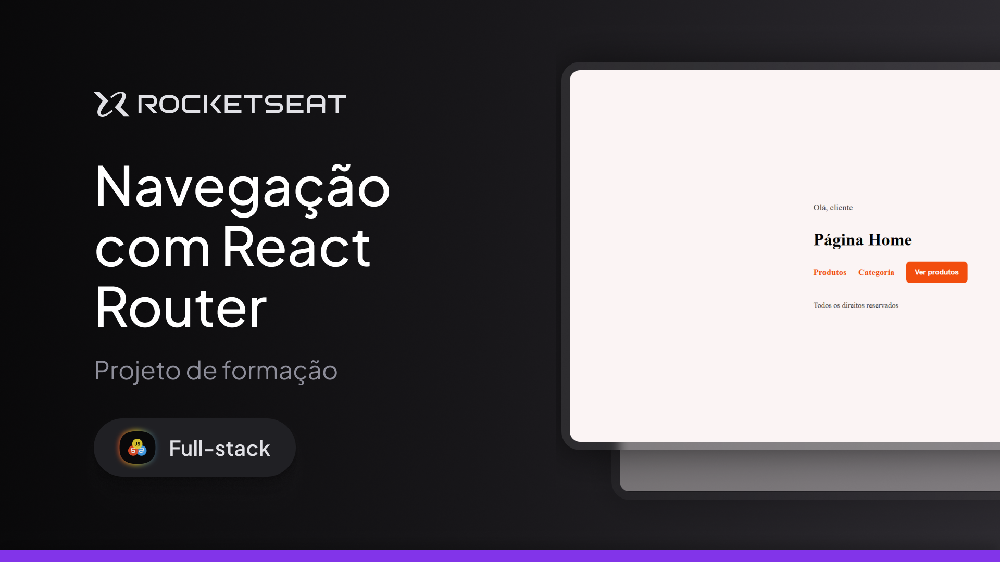

# Navegação com React Router - Rocketseat Full-Stack

Este projeto foi desenvolvido com o objetivo de **praticar e entender o React Router**, criando páginas, navegação entre rotas, parâmetros dinâmicos e query strings.  

---

## 🛠 **Tecnologias e Ferramentas**

Aqui estão as tecnologias utilizadas no desenvolvimento deste projeto:

- **React**: Biblioteca JavaScript para construção de interfaces de usuário
- **React Router**: Biblioteca para navegação entre páginas e gerenciamento de rotas   
- **Vite**: Ferramenta de build e servidor de desenvolvimento rápido  
- **CSS Modules**: Estilização modular e organizada dos componentes  
- **JavaScript**: Manipulação de estado e lógica de navegação   
- **Git e GitHub**: Controle de versão e hospedagem do código  

---

## 💻 **Projeto**

Confira abaixo uma prévia e acesse o projeto completo [aqui](https://navegacaoreact.vercel.app/):



---

## 🎮 **Funcionalidades**

- Acessar a página inicial (**Home**)  
- Navegar para a listagem de **Produtos**  
- Filtrar produtos via **query string** (exemplo: `?category=tvs&price=2000`)  
- Acessar a página de **Detalhes** de um produto pelo **ID dinâmico**  
- Visualizar a página de **Erro 404 (NotFound)** quando acessar uma rota inexistente  

---

## ⚙️ Instalação e Execução

Siga os passos abaixo para clonar o projeto e executá-lo localmente em sua máquina:

### ✅ Pré-requisitos

- [Node.js](https://nodejs.org/) instalado
- [Git](https://git-scm.com/) instalado

### 📥 1. Clone o repositório

```git clone https://github.com/murilloressineti/full-stack-rocketseat.git```

### 📂 2. Acesse a pasta do projeto
```cd full-stack-rocketseat/tree/main/react/avançando-no-react/react-router```

### 📦 3. Instale as dependências
```npm install```

### 🚀 4. Execute o projeto
```npm run dev```

---

## 📝 **Licença**

Este projeto está sob a licença **MIT**. Para mais detalhes, consulte o arquivo [LICENSE](./LICENSE).

---

## 👨🏻‍💻 **Autor**

Feito por **Murillo Ressineti**, aluno da Rocketseat e desenvolvedor Front-end. Conecte-se comigo no LinkedIn para mais informações:

[](https://www.linkedin.com/in/murilloressineti/)

---

## 📬 **Contato**

Se você tiver dúvidas, sugestões ou gostaria de discutir sobre o projeto, sinta-se à vontade para entrar em contato!
