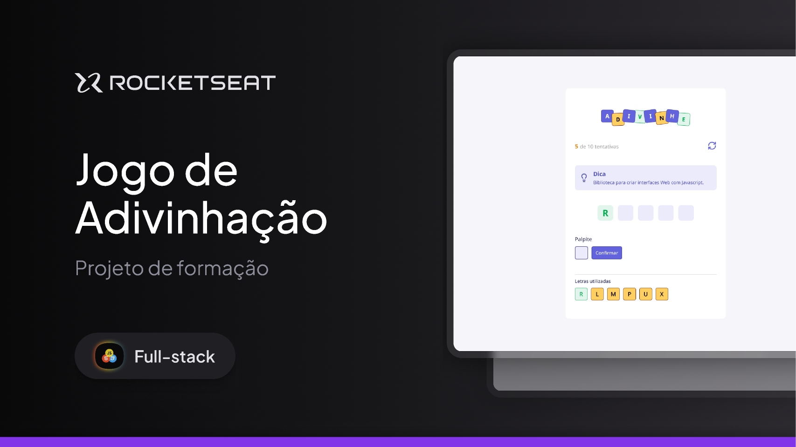

# Jodo de Advinhação - Rocketseat Full-Stack

O **Jogo de Advinhação** é uma aplicação interativa desenvolvida em **React**, onde o usuário precisa adivinhar uma palavra secreta a partir de dicas fornecidas.  
A cada tentativa, o jogador insere uma letra e descobre se ela faz parte ou não da palavra. O jogo contabiliza os acertos e erros, permitindo reiniciar a qualquer momento.

O objetivo é descobrir a palavra antes de atingir o limite de tentativas!

---

## 🛠 **Tecnologias e Ferramentas**

Aqui estão as tecnologias utilizadas no desenvolvimento deste projeto:

- **React**: Biblioteca JavaScript para construção de interfaces de usuário  
- **Vite**: Ferramenta de build e servidor de desenvolvimento rápido  
- **TypeScript**: Tipagem estática para maior segurança e organização do código  
- **CSS Modules**: Estilização modular e organizada dos componentes  
- **JavaScript**: Manipulação de estado, lógica do jogo e interatividade  
- **Git e GitHub**: Controle de versão e hospedagem do código  

---

## 💻 **Projeto**

Confira abaixo uma prévia e acesse o projeto completo [aqui](https://adivinhapalavra.vercel.app/):



---

## 🎮 **Funcionalidades**

- Geração de palavras aleatórias com dica  
- Contagem de tentativas e acertos  
- Feedback visual de letras já utilizadas  
- Validação de entradas repetidas  
- Reinício do jogo a qualquer momento  
- Mensagens de vitória ou derrota  

---

## ⚙️ Instalação e Execução

Siga os passos abaixo para clonar o projeto e executá-lo localmente em sua máquina:

### ✅ Pré-requisitos

- [Node.js](https://nodejs.org/) instalado
- [Git](https://git-scm.com/) instalado

### 📥 1. Clone o repositório

```git clone https://github.com/murilloressineti/full-stack-rocketseat.git```

### 📂 2. Acesse a pasta do projeto
```cd full-stack-rocketseat/tree/main/react/iniciando-no-react/jogo-de-advinhacao```

### 📦 3. Instale as dependências
```npm install```

### 🚀 4. Execute o projeto
```npm run dev```

---

## 📝 **Licença**

Este projeto está sob a licença **MIT**. Para mais detalhes, consulte o arquivo [LICENSE](./LICENSE).

---

## 👨🏻‍💻 **Autor**

Feito por **Murillo Ressineti**, aluno da Rocketseat e desenvolvedor Full-Stack. Conecte-se comigo no LinkedIn para mais informações:

[](https://www.linkedin.com/in/murilloressineti/)

---

## 📬 **Contato**

Se você tiver dúvidas, sugestões ou gostaria de discutir sobre o projeto, sinta-se à vontade para entrar em contato!
